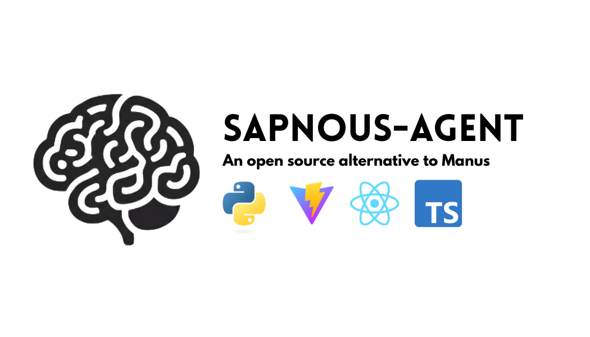
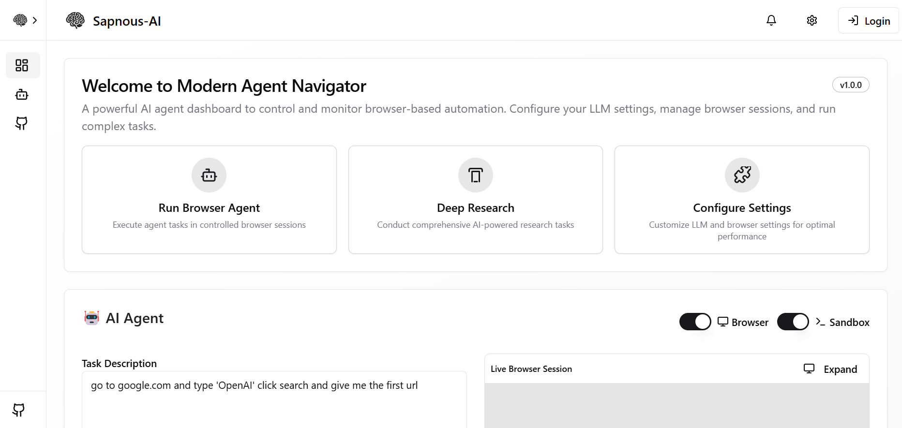
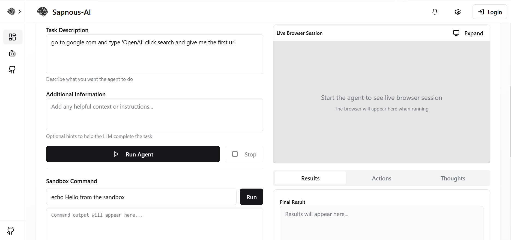
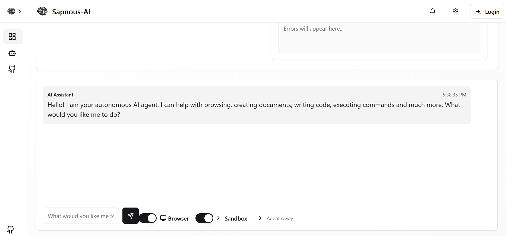

# Sapnous-Agent

## 🚧 Note: Work in Progress 🚧  
This project is still in development and not yet ready for production use. The repository was created just yesterday, and we've already built a frontend for it. Expect frequent updates as we continue adding new features and improving stability in the near future. Stay tuned! 🚀

## 📌 Overview

  


## 🛠️ GitHub Repository  

[](https://github.com/SapnousAI/Sapnous-Agent)  
[](https://github.com/SapnousAI/Sapnous-Agent/fork)  
[](https://github.com/SapnousAI/Sapnous-Agent/issues)  


This is a modern React frontend for the **Browser-Use agent**. It provides a chat interface for interacting with the AI agent, with a live browser preview and other options. 


## 📄 Demo  

  

## 🔗 Hugging Face Model  
This agent uses the **Sapnous-VR-T1** series of models for efficient AI-driven interactions.  
🔗 **[Sapnous-VR-6B on Hugging Face](https://huggingface.co/Sapnous-AI/Sapnous-VR-6B)**  

## 🌐 UI Preview  

  
  
  


## 🚀 Features  
- **Autonomous Web Browsing**: The agent can browse the web without manual input.  
- **Built-in Code Execution**: It has access to an ubuntu sandbox for running scripts.  
- **Document and Website Creation**: It can generate and deploy complete websites.  
- **Self-Hosting & Deployment**: The agent can set up and manage its own hosting environment.  
- **Automated Task Execution**: Sapnous-Agent can independently plan and execute complex tasks, such as creating customized travel itineraries and detailed travel guides. 
- **Data Analysis and Visualization**: It is capable of analyzing financial data, generating comprehensive dashboards, and providing insights into stock performance. 
- **Content Creation**: Sapnous-Agent can produce educational materials, including teaching content and videos for middle schools. 
- **Web Automation**: The agent can interact with web applications, fill out forms, and scrape data, enabling it to perform tasks like insurance policy comparisons and B2B supplier sourcing.
- **Code Execution and Automation**: Sapnous-Agent can write, test, and deploy scripts, facilitating software development and debugging processes.
- **Multi-Modal Capabilities**: It processes and generates various data types, including text, images, and code, making it versatile across sectors like software development, content creation, and research.
- **Advanced Tool Integration**: Sapnous-Agent seamlessly integrates with tools such as web browsers, code editors, and database management systems, allowing it to fetch real-time information and automate workflows

## ✅ To-Do List  
- [x] Enable seamless web browsing  
- [x] Implent an Ubuntu Sandbox 
- [ ] Implement AI-powered document creation  
- [ ] Self hosting and website deployment   
- [ ] Improve UI

---
 
## Installation

## Prerequisites  

- Node.js 18+  
- Python 3.11+  
- npm, yarn, or pnpm  
- Git  

## Local Setup Guide (Detailed)  

### 1️⃣ Clone the Repository  

```bash
git clone https://github.com/SapnousAI/Sapnous-Agent.git
cd Sapnous-Agent
```

### 2️⃣ Setup Backend  

#### Windows  
1. Run the provided setup script:  
   ```
   setup-windows.bat
   ```
   Or manually:  
   ```bash
   python -m venv venv
   venv\Scripts\activate
   pip install -r requirements.txt
   copy .env.example .env
   ```

#### macOS/Linux  
1. Run the setup script:  
   ```bash
   chmod +x setup.sh
   ./setup.sh
   ```
   Or manually:  
   ```bash
   python3 -m venv venv
   source venv/bin/activate
   pip install -r requirements.txt
   cp .env.example .env
   ```

2. Edit `.env` and add API keys for LLM services.  

---

## 📖 Setting Up the Backend with Astral's UV  

Instead of using a standard Python environment, you can use **Astral’s UV** for an efficient and isolated backend setup.  

### 1️⃣ Install UV  
```bash
curl -fsSL https://astral.sh/install-uv.sh | sh
# or using pip
pip install uv
```

### 2️⃣ Clone the Repository  
```bash
git clone https://github.com/SapnousAI/Sapnous-Agent.git
cd Sapnous-Agent
```

### 3️⃣ Set Up Backend with UV  
```bash
uv venv .venv
uv pip install -r requirements.txt
source .venv/bin/activate
```

### 4️⃣ Run the Backend  
```bash
python main.py --api-host 0.0.0.0 --api-port 7788
```

---

### 3️⃣ Setup Frontend  

#### Windows  
```bash
cd frontend
npm install
copy .env.example .env
```

#### macOS/Linux  
```bash
cd frontend
npm install
cp .env.example .env
```

---

### 4️⃣ Start the Application  

#### Windows  
```bash
start-app-windows.bat
```
Or manually:  
```bash
python main.py --api-host 0.0.0.0 --api-port 7788
cd frontend
npm run dev
```

#### macOS/Linux  
```bash
python main.py --api-host 0.0.0.0 --api-port 7788
cd frontend
npm run dev
```

Access at **[http://localhost:8080](http://localhost:8080)**  

---

## 🔧 Important Environment Variables  

- **LLM API Keys**: `OPENAI_API_KEY`, `ANTHROPIC_API_KEY`, etc.  
- **Browser Settings**:  
  - `CHROME_PATH`: Path to Chrome executable  
  - `CHROME_USER_DATA`: Chrome user data directory  
  - `CHROME_PERSISTENT_SESSION`: `"true"` to keep sessions  
- **Sandbox Settings**:  
  - `ENABLE_SANDBOX`: `"true"` to enable  
  - `SANDBOX_USER`: Username  
  - `SANDBOX_PASSWORD`: Password  

---

## 🚨 Troubleshooting  

- **"Browser failed to start"**: Check Chrome path in `.env`  
- **"Sandbox not initialized"**: Ensure `ENABLE_SANDBOX=true`  
- **API issues**: Ensure backend is running at correct URL  
- **Module errors**: Run `npm install` in `frontend/`  
- **Python module errors**: Ensure virtual environment is activated  

---

## 🐳 Docker Setup (Alternative)  

1. Ensure Docker & Docker Compose are installed.  
2. Create `.env` file:  
   ```bash
   copy .env.example .env  # Windows
   cp .env.example .env  # macOS/Linux
   ```
3. Run with Docker Compose:  
   ```bash
   docker compose up --build
   ```
4. Access the application at:  
   - Backend: [http://localhost:7788](http://localhost:7788)  
   - VNC Viewer: [http://localhost:6080/vnc.html](http://localhost:6080/vnc.html)  

---
